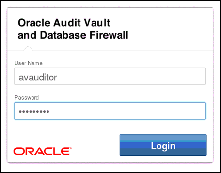
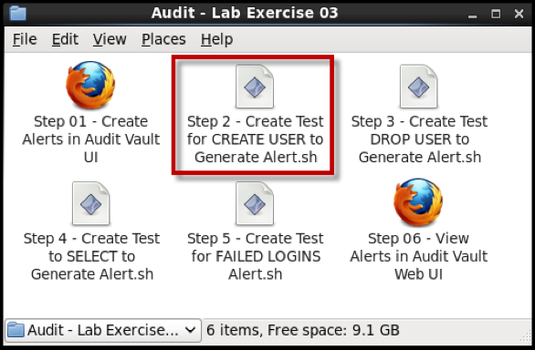
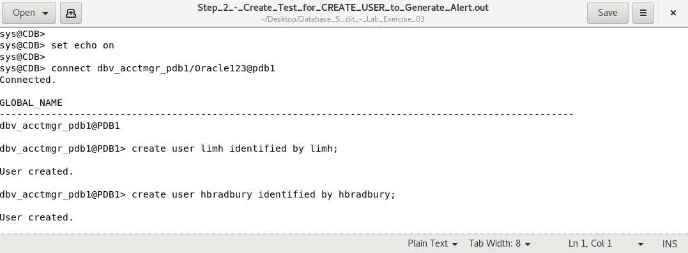
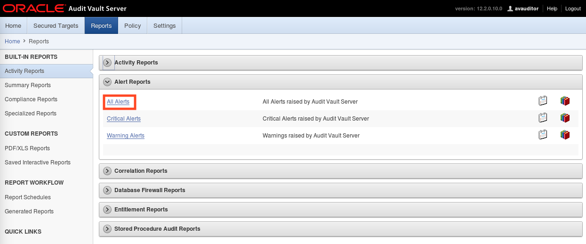
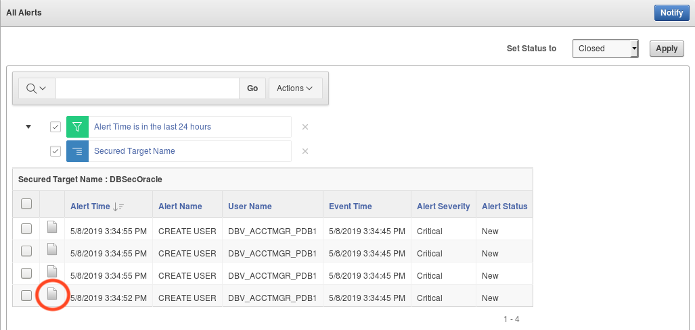
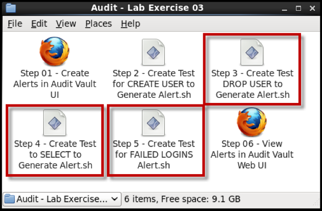
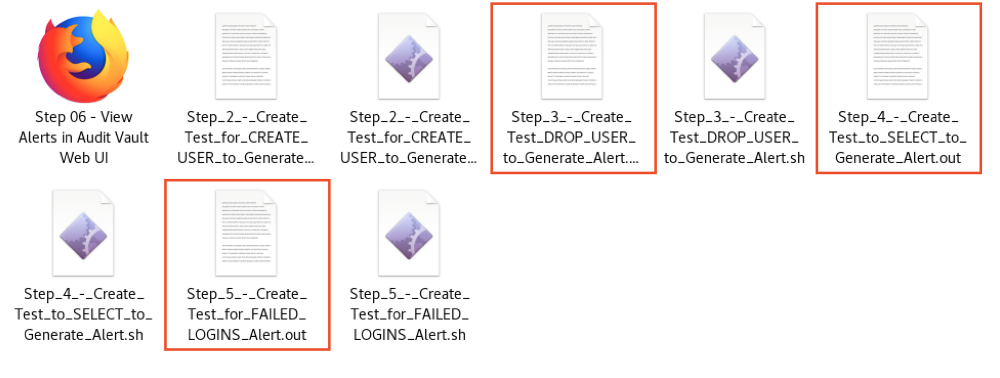
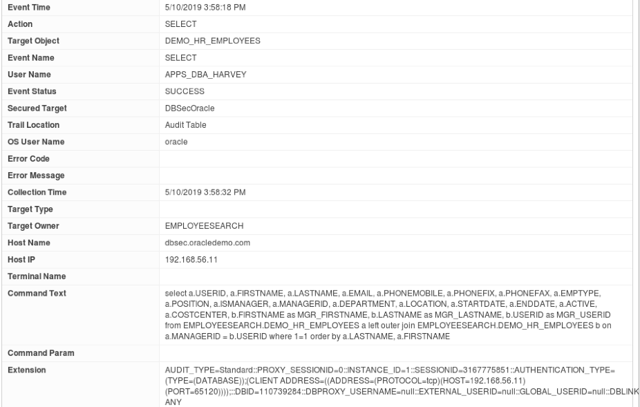

# Audit Vault and Database Firewall

## Lab 300: GAIN REAL-TIME DATABASE ACTIVITY MONITORING USING AUDIT VAULT AND DATABASE FIREWALL ALERTING 

### Overview

Oracle Audit Vault and Database Firewall provides security personnel with the ability to detect and alert on activities that may indicate attempts to gain unauthorized access and/or abuse system privileges. Oracle Audit Vault can generate alerts for system defined and user defined audit events. Oracle Audit Vault continuously monitors the audit data collected, evaluating the activities against defined alert conditions. Alerts can be associated with any auditable database event including system events such as changes to application tables and creating privileged users. For instance, an alert could be generated when someone attempts to access sensitive business information. The Oracle Audit Vault interface provides graphical summaries of activities causing alerts. These include a summary of alert activity and top sources by number of alerts. Oracle Audit Vault users can click the summary graphs and drill down to a more detailed report. Alerts for the purpose of reporting are grouped by the sources with which they are associated. Alerts can also be grouped by the event category to which the event belongs, and by the severity level of the alert (warning or critical).

- You should have already completed Lab Configuration 02 – REDUCE TIME TO COMPLIANCE USING ORACLE AUDIT VAULT REPORTING before using this lab

- In this lab exercise, you will accomplish the following:

	- Modify the email template for Audit Vault Alerts
	- Add a new Audit Vault Alert Status
	- Create an Audit Vault Alert with the Web Interface
	- Test that the alert is functioning
	- View the near real-time nature of alert functionality
     
#### GAIN REAL-TIME DATABASE ACTIVITY MONITORING USING AUDIT VAULT ALERTING
    
- We will out of the  **Audit – Lab Exercise 03** Folder

  

- However, open up **FireFox** from the desktop and go to the *Audit Vault Server (https://av.oracledemo.com)*

- Log into the Audit Vault console as **avauditor/Oracle123+**.

  

- Navigate to the **Settings** tab:

  

- Select the **Email Templates** tab.  From here will be able to manage the existing template definitions and create new ones.  Once at this page you will see the following:

  

- Edit the **Alert Notification Template**, which is the default template for sending emails.  You could create a new template, but to simplify this lab, just edit the existing one.  Click the **Alert Notification Template** link on the left hand side of the page.

  

- Add the **#AlertStatus#** field into the email subject, as shown in the screen below.  Click the **Save** button once completed. 

  
  
- Navigate to the **Policy** tab. Find and click the **Manage Alert Status Values** button. 

  
  
- There are two default Alert status values, Alert Status and Description.  These values are used to maintain a status for each alert that is created in Audit Vault.  You can then manage alerts according to your business requirements.  In this lab, you will add a new status to report that you are reviewing a given alert.  Click the **Create** button.
  
- Add a new **Alert Status** and enter the following information

```
	**Status Value**:	REVIEWING
	**Description**: 	Alert being reviewed
```
- Click the **Save** button.
 
 	


- You will now create a new alert in Audit Vault.  This alert is to report when a new Oracle DB User account has been created.  Find the **Alerts Definitions** tab.  Click the **Create** button.

  
  
- Enter the following information for the Alert:
 
 ```
	Name: 			CREATE_USER
	Secured Target Type		Oracle Database
	Severity: 			Critical
	Threshold (times)		1
	Duration (min)		0
	Group By (field)		<Default>
	Description			Alert when a user is created
	Condition			:EVENT_NAME='CREATE USER'
	Notification Template:	<‘Alert Notification Template’>
	Distribution List:		<No Distribution List>
```

  

- Click Save to create the alert.

- Verify that you can see the newly created alert in the summary screen, as shown below.

  
  
- Go back to your open folder for **Audit – Lab Exercise 03** and execute the script to create some new users in the pdb1 database by clicking on the **Step_2_–_Create_Test_for_CREATE_USER_to_Generate_Alert.sh** icon as shown below.

  
  
- Click the icon, **Step_2_-_Create_Test_for_CREATE_USER_to_Generate_Alert.out** to view the results of the executed scripts

  
  
- Back to Audit Vault Server on Firefox, go to the **Home page** and click the arrow in the upper right hand corner of the **Recently Raised Alerts** panel, as shown below.

  

- Alternatively, you may go to the **Reports** page and select **All Alerts** under the section Alert Reports.

  

- Your alert report will look similar to that shown below.  Click the oldest entry in the list of alerts.

  
  
- Collapse the **Alert Details** section that’s expanded by default.  Examine the **Event** section first.  You may find it useful to add the **Target Object** column here (using the **Actions** button), as shown below.  If you do this once, it will show up in every other Alert that you view.  In this case, it shows the username of the user created that generated the Alert.  
  

- Without the **Target Object** column, you would need to drill down into the audit record to view the username.  Note that the password is obfuscated in the audit record.

  
  
- Click the **Report View** button to return to the Alert.  Examine the other sections.  Note how you can change the status of the Alert, make notes, send a notification right from this screen, etc.  If you were able to configure email in this lab environment, the Alert could have been mailed to you automatically when it was generated.

- Create three more alerts.  Repeat the steps above to create another alert for the **DROP USER** command and another alert that will provide notification when a DBA user account attempts to directly access data outside of the intended application user account.  Finally, you will examine use of the threshold setting via a **FAILED LOGIN** alert. To get there go to **Policy** tab then **Alert Definitions** and then **Create**
	
- Enter the following information for the **DROP_USER** Alert. 
```
	Name: 			DROP_USER
	Secured Target Type:	Oracle Database
	Severity: 		Warning
	Threshold (times):	1
	Duration (min):		0
	Group By (field):	<Default>
	Description:		Alert when a user is dropped
	Condition:		:EVENT_NAME='DROP USER'
	Notification Template:	<‘Alert Notification Template’>
	Distribution List:	<No Distribution List>
``` 

- Enter the following information for the **EMPLOYEE_SELECT_NON_APP** Alert. 
```	
	Name: 			EMPLOYEE_SELECT_NON_APP
	Secured Target Type:	Oracle Database
	Severity: 		Critical
	Threshold (times):	1
	Duration (min):		0
	Group By (field):	<Default>
	Description:		Alert when a DBA user account attempts to directly access data 
	Condition:		(:EVENT_NAME='SELECT' OR :EVENT_NAME='UPDATE') AND :USER_NAME LIKE '%DBA%'
	Notification Template:	<‘Alert Notification Template’>
	Distribution List:	<No Distribution List>
```

- Enter the following information for the **FAILED_LOGIN** Alert.  
```
	Name: 			FAILED_LOGIN 
	Secured Target Type:	Oracle Database
	Severity: 		Critical
	Threshold (times):	5
	Duration (min):		1
	Group By (field):	<Default>
	Description:		Alert when a user attempts to log in unsuccessfullymultiple times 
	Condition:		:command_class = 'LOGON' and :event_status = 'FAILURE'
	Notification Template:	<‘Alert Notification Template’>
	Distribution List:	<No Distribution List>
```

- Click **Add to List** to add the notification action and profile then click **Save**. 

- Return to the Oracle Linux Desktop to the folder for **AV – Lab Exercise 03**. 

- Click the icons, **Step 3 – Create Test DROP USER to Generate Alert.sh** and **Step 4 – Create Test to SELECT to Generate Alert.sh** and **Step 5 – Create Test for FAILED LOGINS.sh** to generate database activity on PDB1 to all both alert conditions.

  
  
- Click the icons, **Step_3_–_Create_Test_DROP_USER_to_Generate_Alert.out**, **Step_4_–_Create_Test_to_SELECT_to_Generate_Alert.out** and **Step_5_–_Create_Test_for_FAILED_LOGINS.out** to view the results of the executed scripts.  
  
  
  
- Return to your browser window or go to the folder **AV – Lab Exercise 03** and click the icon **Step 06 – View Alerts in Audit Vault Web UI**.  Review the alerts generated.

  

- Look at the **Activity Reports** under the **Reports** tab 

  
  
- On the screen above, click through to the details for the Alert Name **EMPLOYEE_SELECT_NON_APP**. Review the details of this alert that helped identify an unauthorized activity by a user other than the expected application user. 

  

 #### Summary

- In this lab, you:
	- Configured Audit Vault Alerting 
	- Created an Audit Vault Alert.
	- Triggered the alert via a single SQL action.
	- Triggered the alert via several SQL actions

**This completes the lab!**

- [Database Security Workshop Landing Page](https://github.com/kwazulu/dbsec-workshop/blob/master/README.md)

- [Next Lab](/../400)