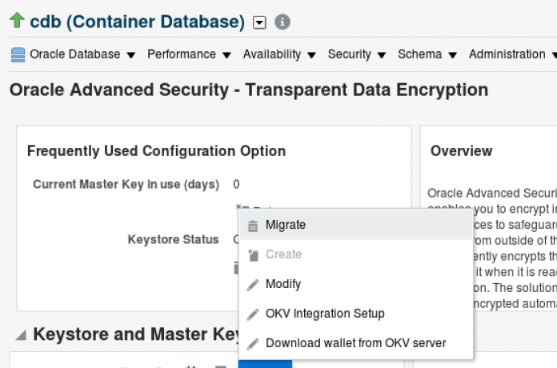

# Database Security Workshop: Oracle Key Vault

#### Overview

-In this lab exercise, you will accomplish the following:
 - View TDE Wallet and Masterkey in Enterprise Manager
 - Migrate an existing local wallet to Online Master Key
 - Perform a TDE Key Rotation with Online Master Key

### LAB EXERCISE 200: TDE ONLINE MASTER KEY

- Open Enterprise Manager in Firefox

- Login to EM as SYSMAN / Oracle123
- Navigate to the database cdb - container database

- Login to cdb as SYS

- Click the Security Tab then click Transparent Data Encryption

- You may be prompted to set the identifier

    
    
- Under **Keystore and Master Keys** click **More** and choose **OKV Integration Setup**
- Choose **OS_ORACLE** as the Host Credentials
- Set the **OKV Library Path** to

        /app/oracle/dbsec/product/okvclient/bin
        
- Set the **OKV Wallet Group** to 
 
       cdb

- Set the **OKV Endpoint Password** to 
 
       Oracle123

- Your screen will look like this
   

- Test the Integration

- Click Migrate

    
    
- If necessary, select OS_ORACLE as your Named Credential

- Set your migrate keystore variables to look like this

       Configuration File: /app/oracle/dbsec/product/19.0.0/dbhome_1/network/admin
       Wallet Location: /app/oracle/dbsec/admin/cdb/wallet
       Wallet Password: Oracle123
       Password or Connect String: null 
       Local Library Location: /opt/oracle/extapi/64/hsm/oracle/1.0.0

           
    
 
- If you are prompted to login, login as *SYS*
- If the browser moves you to **pdb1** navigate back to **cdb**
- You should see the Keystore say:

        OKV - OKV

- Perform a key rotation by clicking *Rekey*

        Password or Connect String: null
        Key Description: Test rekey
            
    
    

- Confirm you want to perform the key rotation
    - Select on **All Containers**

## Remove the local wallet files

- From the terminal, perform the following commands

        cd $ORACLE_BASE/admin/cdb/wallet
        mkdir old.wallets
        mv * old.wallets

- Restart the database

        $HOME/scripts/stop_cdb.sh
        
        $HOME/scripts/start_cdb.sh
        
- Login to the database and issue the following queries

        sqlplus system/Oracle123@pdb1
        select count(*) from employeesearch.demo_hr_users;
        
## Conclusion

This lab has demonstrated migrating the Transparent Data Encryption wallet from a local file on the database server to Oracle Key Vault, using **Online Master Key**.

    
**This completes the Lab!**

- [Database Security Workshop Landing Page](https://github.com/kwazulu/dbsec-workshop/blob/master/README.md)
